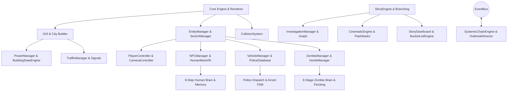

# FreeWorld Engine — Architectural Specification & Subsystem Blueprint

## System Overview
FreeWorld is a high-performance, browser-native 3D open-world simulation engine built with Vanilla JavaScript, Three.js, and an EventBus architecture. The architecture is decoupled into core infrastructure, spatial simulation, AI brains, narrative systems, and UI telemetry.

---

## 1. Core Architecture (`src/Core/`)
- **`Engine.js`**: Core animation loop (requestAnimationFrame), Three.js Scene, Perspective Camera, WebGL Renderer, ambient/directional lights, and updatable entity loop.
- **`GameState.js`**: Central singleton state store (Save Version V5), managing persistent state across player, world, police, economy, investigation, narrative, and bucket list.
- **`EntityManager.js`**: High-performance spatial entity registry indexing Player, Vehicles, Pedestrians, Zombies, Police, and Props.
- **`SectorManager.js`**: 2D Grid spatial partitioning (60m x 16m cells) for high-performance proximity queries, occlusion, and simulation LOD demotion.
- **`CollisionSystem.js`**: Axis-Aligned Bounding Box (AABB) and Oriented Bounding Box (OBB) collision detector with 5 collision layers (`WORLD`, `BUILDING`, `PLAYER`, `VEHICLE`, `NPC_ZOMBIE`).
- **`InputManager.js`**: Unified input abstraction supporting Keyboard, Mouse PointerLock, Gamepad, and F1–F9 diagnostic keybindings.
- **`PerformanceManager.js`**: Automatic frame-budget monitor. Executes 3-tier dynamic quality throttling when 3 consecutive frames exceed 22ms (~45 FPS drop).

---

## 2. World & Infrastructure (`src/World/`, `src/WorldSystems/`)
- **`CityBuilder.js`**: Procedural or GIS-imported urban layout generator producing roads, intersections, building footprints, sidewalks, and streetlamps.
- **`NavigationGraph.js`**: Waypoint node graph (360 nodes, 4 lanes) enabling pathfinding for traffic vehicles, pedestrians, police, and zombies.
- **`BuildingStateEngine.js`**: 9-state state machine (`NORMAL`, `ACTIVE`, `ABANDONED`, `POWER_FAILURE`, `LOCKDOWN`, `DAMAGED`, `INFESTED`, `OVERRUN`, `SAFEHOUSE`) controlling visual aesthetics, door locks, security shutters, and lighting.
- **`InteriorGenerator.js`**: Multi-floor interior room hierarchy generator (rooms, doors, windows, light fixtures, furniture props).
- **`PowerManager.js`**: Systemic multi-tier power grid (Master Grid, 5 District Grids, Building Circuit Breakers, Emergency Backup Generators).
- **`OutbreakDirector.js`**: City-wide apocalypse telemetry tracker (`outbreakLevel`, `infectedPopulation`, `zombiePopulation`, `policeCapacity`, `districtSafety`).
- **`CityCollapseEngine.js`**: 7-stage district safety state machine (`NORMAL`, `WARNING`, `PANIC`, `EVACUATION`, `QUARANTINE`, `COLLAPSE`, `OVERRUN`).
- **`SystemicChainEngine.js`**: Unscripted domino chain engine evaluating event propagation across 10 emergency event types.

---

## 3. Human Simulation & NPC Brain (`src/NPC/`, `src/Human/`)
- **`HumanMesh.js`**: Procedural PBR human character mesh generator (custom proportions, skin materials, wetness, dirt, hair, clothing).
- **`HumanAnimationFSM.js`**: Locomotion finite state machine (`IDLE`, `WALK`, `JOG`, `SPRINT`, `STUMBLE`, `CROUCH`).
- **`InverseKinematics.js`**: 2-joint Analytical IK for feet alignment on terrain and hand placement on vehicle doors/handles.
- **`NPCBrain.js`**: 8-step decision pipeline: `PERCEIVE` $\rightarrow$ `INTERPRET` $\rightarrow$ `REMEMBER` $\rightarrow$ `EVALUATE` $\rightarrow$ `SELECT GOAL` $\rightarrow$ `SELECT ACTION` $\rightarrow$ `EXECUTE` $\rightarrow$ `UPDATE MEMORY`.
- **`NPCPersonality.js`**: 8-trait matrix (`bravery`, `fear`, `aggression`, `curiosity`, `loyalty`, `selfishness`, `discipline`, `riskTolerance`).
- **`NPCMemory.js`**: 10-event memory ledger with confidence decay over time.
- **`DarknessBehavior.js`**: Flashlight and smartphone screen light activation during night/blackouts and light-seeking navigation.

---

## 4. Vehicle & Police Ecosystem (`src/Vehicles/`, `src/Police/`)
- **`VehicleRegistry.js`**: Global registry tracking `vehicleId`, `ownerId`, `vehicleType`, `condition`, `fuel`, `keys`, `alarm`, `plate`, `reportedStolen`, `stolenState`.
- **`PoliceDatabase.js`**: Automated Plate Recognition (ANPR) database maintaining active stolen vehicle reports and BOLO lookouts.
- **`PoliceOfficerAI.js`**: Foot officer AI executing 5 arrest stages (`APPROACHING`, `COMMANDING`, `SURRENDER_ARREST`, `PURSUIT`, `ENGAGED`).
- **`WantedSystem.js` & `PoliceDispatch.js`**: 5-star wanted level escalation and tactical cruiser dispatch.

---

## 5. Zombie & Horde AI (`src/Zombies/`, `src/Horde/`)
- **`InfectionSystem.js`**: 6-stage dynamic infection lifecycle (`HEALTHY` $\rightarrow$ `EXPOSED` $\rightarrow$ `INFECTED` $\rightarrow$ `SYMPTOMATIC` $\rightarrow$ `SEVERE` $\rightarrow$ `TRANSFORMATION` $\rightarrow$ `ZOMBIE`).
- **`ZombieBrain.js`**: 8-stage AI state machine (`PERCEIVE` $\rightarrow$ `INVESTIGATE` $\rightarrow$ `TARGET` $\rightarrow$ `CHASE` $\rightarrow$ `ATTACK` $\rightarrow$ `SEARCH` $\rightarrow$ `LOSE TARGET` $\rightarrow$ `WANDER`).
- **`FlockingSystem.js` & `HordeManager.js`**: Autonomous horde flocking (cohesion, alignment, separation) reacting to 8 noise and crowd triggers.

---

## 6. Narrative, Clues & Progression (`src/Story/`, `src/BucketList/`, `src/UI/`)
- **`StoryState.js` & `StoryEngine.js`**: 6-chapter branching narrative manager.
- **`InvestigationManager.js`**: 11-clue discovery graph unlocking story objectives.
- **`CinematicEngine.js` & `FlashbackSystem.js`**: Live-world spline camera paths and sepia/monochrome flashbacks.
- **`BucketListEngine.js` & `BucketListData.js`**: 100 original activities across 12 categories with cash/XP rewards.
- **`DebugOverlayManager.js`**: 9 diagnostic F1–F9 overlays for real-time developer telemetry.
