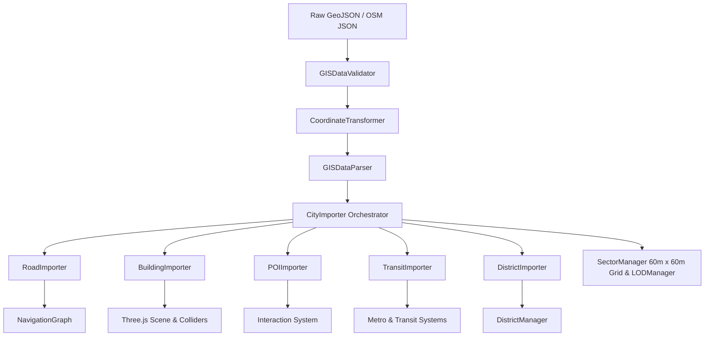

# FREEWORLD — REAL-WORLD GIS CITY PIPELINE DOCUMENTATION

## 🌐 OVERVIEW

The **FreeWorld GIS City Pipeline (v5.0)** enables the game engine to reconstruct 3D urban environments directly from real-world geographic datasets (GeoJSON, OpenStreetMap JSON) while preserving geographic fidelity, topological relationships, district boundaries, and transit networks.

If GIS data is absent or invalid, the pipeline seamlessly transitions to procedural city graph synthesis, ensuring zero gameplay disruption.

---

## 📐 COORDINATE SYSTEM & NORMALIZATION

Raw latitude and longitude coordinates are **never** used directly as Three.js 3D world space coordinates. The pipeline enforces a 3-stage coordinate normalization pipeline:

$$\text{Source Coordinates (WGS84 Lat/Lon/Alt)} \xrightarrow{\quad\text{Geographic Normalization}\quad} \text{Local Engine Space (Cartesian X, Y, Z)}$$

### Projection Formula (`CoordinateTransformer.js`)
Given origin latitude $\text{lat}_0$, longitude $\text{lon}_0$, altitude $\text{alt}_0$:

- **Latitude scaling constant**: $M_{\text{lat}} = 111,320\text{ meters / degree}$
- **Longitude scaling constant**: $M_{\text{lon}} = M_{\text{lat}} \cdot \cos\left(\text{lat}_0 \cdot \frac{\pi}{180}\right)$
- **Local X (East / West)**: $X = (\text{lon} - \text{lon}_0) \cdot M_{\text{lon}}$
- **Local Y (Elevation / Altitude)**: $Y = \text{alt} - \text{alt}_0$
- **Local Z (North / South)**: $Z = -(\text{lat} - \text{lat}_0) \cdot M_{\text{lat}}$ *(North is negative Z in Three.js standard coordinates)*

---

## 🏗️ PIPELINE ARCHITECTURE & DATA FLOW



---

## 🔌 MODULE REFERENCE

### 1. `CoordinateTransformer.js`
- **`geoToLocal(lat, lon, alt)`**: Converts WGS84 coordinates to local `THREE.Vector3(x, y, z)`.
- **`localToGeo(x, z, y)`**: Reverse transforms local Cartesian coordinates back to `{ lat, lon, alt }`.
- **`haversineDistance(lat1, lon1, lat2, lon2)`**: Computes Earth curvature surface distance in meters.

### 2. `GISDataValidator.js`
- **`validateGeoJSON(geoJson)`**: Validates FeatureCollection structure, coordinate sanity, polygon closure, and bounding box.
- **`validateOSMJSON(osmJson)`**: Validates Overpass API elements (nodes, ways, relations).
- **`validateGraph(graph)`**: Ensures graph nodes, edges, footprints, POIs, and districts are well-formed.

### 3. `GISDataParser.js`
- Parses GeoJSON & OSM JSON into standardized graph features.
- Normalizes buildings, road edges, intersections, POIs, landmarks, transit stations/routes, and administrative districts.

### 4. `RoadImporter.js`
- Identifies road junctions (nodes connected to $>2$ edges).
- Calculates lane counts ($3.5\text{m}$ width per lane), road width, speed limits, bridges, and tunnels.
- Populates `NavigationGraph.roadNodes` for vehicle and pedestrian pathfinding.

### 5. `BuildingImporter.js`
- Extrudes 3D polygon footprints into height-accurate building meshes (`ExtrudeGeometry`).
- Classifies building types (`commercial`, `residential`, `industrial`, `skyscraper`, `landmark`).
- Registers collision boxes (`Box3`) with `CollisionSystem`.
- Hooks into `BuildingStateEngine` (9 building states in Phase 5).

### 6. `POIImporter.js`
- Categorizes POIs (banks, armories, dealerships, gas stations, hospitals, police stations, safehouses).
- Generates 3D interactive markers and color-coded map indicators.

### 7. `TransitImporter.js`
- Processes transit stations (subway entrances, train stations, bus stops) and route line paths.
- Establishes topological links between stations and routes for metro line simulation.

### 8. `DistrictImporter.js`
- Processes district polygon boundaries and calculates geographic centroids.
- Provides point-in-polygon containment test (`containsPoint(pos)`) for district entry/exit detection.

### 9. `CityImporter.js`
- Master orchestrator connecting all specialized importers.
- Spatially partitions imported entities into 60m x 60m `SectorManager` sectors.
- Provides procedural fallback synthesis if no GIS data is supplied.

---

## ⚡ PERFORMANCE & SECTOR STREAMING

- **Spatial Partitioning**: Imported GIS elements are assigned to `SectorManager` grid sectors (60m x 60m).
- **Multi-Tier LOD**: `LODManager` controls rendering tiers based on distance from the player:
  - `NEAR` ($<75\text{m}$): Full detail geometry & colliders.
  - `MID` ($75-180\text{m}$): Simplified meshes.
  - `FAR` ($180-320\text{m}$): Low-poly proxies.
  - `UNLOADED` ($>320\text{m}$): Culled from scene.

---

## ✅ VERIFICATION RESULTS

Run verification tests:
```bash
node tests/test_gis_pipeline.js
```
- **33 / 33 Unit & Integration Tests Passed**:
  - Coordinate conversion precision & roundtrip accuracy ($\le 0.0001^{\circ}$).
  - GISDataValidator error trapping.
  - GeoJSON & OSM JSON parsing.
  - Specialized Importers (Road, Building, POI, Transit, District).
  - NavigationGraph integration.
  - SectorManager spatial partitioning.
  - Procedural fallback synthesis.
